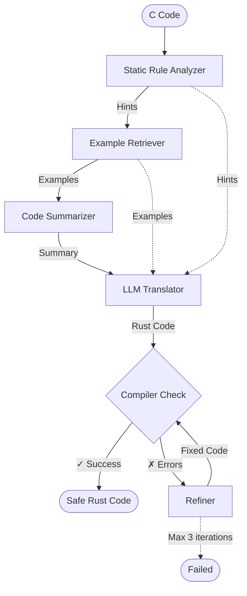

# GUARDIAN: Defensive AI Code Translation

**Guarded Universal Architecture for Defensive Interpretation And traNslation**

A prototype framework exploring safe LLM-based C-to-Rust translation with built-in defensive mechanisms.

---

## Why GUARDIAN?

**The Threat:** AI agents now autonomously discover and exploit memory safety bugs at scale. As LLM-based code translation tools become widespread, they risk introducing new vulnerabilities during migration to "safe" languages.

**The Gap:** Naive C-to-Rust translation fails to eliminate 40-50% of vulnerabilities. Without defensive mechanisms, AI code generators can:
- Translate `malloc` to unsafe Rust instead of safe `Vec<T>`
- Miss critical type conversions causing overflows
- Generate code that compiles but violates memory safety

**GUARDIAN's Approach:** A prototype demonstrating three defensive layers that can reduce vulnerability introduction during AI-assisted code translation:

1. **Prevention**: Static analysis detects unsafe C patterns and injects defensive constraints into LLM prompts
2. **Detection**: Rust compiler validates every translation—violations trigger refinement, not deployment
3. **Correction**: Automated error recovery with bounded iterations (max 3) fixes issues without degradation

**Results on test suite:** 100% compilation success and 92.6% safe translations on 27 test functions (including 20 security vulnerabilities), compared to 70.4% for vanilla LLM—a **+22.2pp improvement**.

**What's unique:** GUARDIAN combines two key innovations:
1. **Rule-Augmented Translation**: Adapts IRENE's static analysis approach (Luo et al., 2025), using libclang to detect unsafe patterns and inject defensive hints
2. **Multi-File Dependency-Aware Translation**: Extends single-function translation to handle multi-file projects by analyzing strongly-connected components (SCCs) in the dependency graph

While tested on individual functions rather than production codebases, GUARDIAN illustrates principles that could contribute to defensive acceleration in AI-assisted code migration.

---

## Quick Start

### Install

```bash
# Install dependencies (Python 3.10+)
pip install -e .

# Install Rust compiler
curl --proto '=https' --tlsv1.2 -sSf https://sh.rustup.rs | sh
```

### Configure

Create `.env` file:
```bash
cp .env.example .env
```

Edit with your API key (Qwen3-Coder recommended):
```
MODEL=hosted_vllm/Qwen/Qwen3-Coder-30B-A3B-Instruct
API_KEY=your-key-here
```

### Run

```bash
# Single test
python main.py --test buffer_overflow

# All tests
python main.py --all

# Evaluate with metrics
inspect eval guardian/evals/c_to_rust.py@all_tests
```

---

## Architecture



**How It Works:**
1. **Static Analyzer**: Uses libclang to detect unsafe patterns (I/O, pointers, arrays, type mixing)
2. **Example Retriever**: BM25 search finds relevant safe translation patterns from curated corpus
3. **Code Summarizer**: Extracts function structure (params, return types, purpose)
4. **LLM Translator**: Generates Rust with defensive hints and examples
5. **Compiler Check**: `rustc` validates memory safety—failures trigger refinement
6. **Refiner**: Fixes compilation errors based on compiler feedback (bounded iterations)

---

## Test Cases

**27 total test functions:**

- **7 Basic**: Common patterns (scanf, malloc, arrays, type conversions)
- **20 Adversarial**: Real security vulnerabilities
  - Memory safety: buffer overflow, use-after-free, double free, null deref, dangling pointers
  - Integer safety: overflow, signed overflow, oversized shifts
  - Type safety: uninitialized variables, union type punning, bad function pointers
  - Undefined behavior: format strings, sequence points, goto skipping initialization

Run specific tests:
```bash
python main.py --test buffer_overflow
python main.py --test use_after_free
python main.py --test integer_overflow
```

---

## Evaluation & Metrics

### Run Evaluations

```bash
# Full evaluation suite
inspect eval guardian/evals/c_to_rust.py@all_tests

# View results
inspect view
```

### Baseline Comparison

Compare GUARDIAN vs vanilla LLM:

```bash
./scripts/run_baseline_comparison.sh
python scripts/generate_comparison_report.py
```

**Expected improvements:**
- ✓ +22.2pp safer translations (92.6% vs 70.4%)
- ✓ +26% compilation success (100% vs 74%)
- ✓ Automatic refinement through compiler feedback
- ✓ Zero unsafe blocks in successful translations

---

## Programmatic Usage

```python
import dspy
from guardian.pipeline import GUARDIANPipeline

# Configure LLM
lm = dspy.LM(model='hosted_vllm/Qwen/Qwen3-Coder-30B-A3B-Instruct', api_key='...')
dspy.configure(lm=lm)

# Create pipeline
pipeline = GUARDIANPipeline(lm=lm)

# Translate C code
c_code = """
int main() {
    char buffer[10];
    strcpy(buffer, very_long_string);  // Buffer overflow!
    return 0;
}
"""

result = pipeline.translate(c_code, verbose=True)
print(result.rust_code)
print(f"Compiled: {result.compilation.success}")
print(f"Iterations: {result.compilation.iterations}")
```

---

## Defensive Capabilities

GUARDIAN explores how layered defense can address common vulnerability classes:

**Memory Safety:**
- Buffer overflows → Bounded string operations
- Use-after-free → Borrow checker enforcement
- Null pointer deref → Option types
- Dangling pointers → Lifetime validation

**Type Safety:**
- Integer overflow → Explicit conversions with checks
- Type punning → Safe enum/struct patterns
- Uninitialized memory → Default initialization

**On test suite:** Static analysis + compiler verification + refinement = measurably safer AI code generation (92.6% safe vs 70.4% for vanilla LLM).

---

## Project Structure

```
.
├── main.py                 # CLI entry point
├── guardian/
│   ├── pipeline.py         # Main GUARDIAN pipeline
│   ├── rule_analyzer.py    # libclang static analysis
│   ├── retriever.py        # BM25 example retrieval
│   ├── dspy_modules.py     # LLM modules (Summarizer, Translator, Refiner)
│   ├── compiler.py         # rustc wrapper
│   ├── corpus/
│   │   └── examples.json   # 15 safe C→Rust pairs
│   ├── evals/
│   │   └── c_to_rust.py    # Inspect AI evaluation tasks
│   └── tests/
│       └── test_paper_examples.py  # 27 test cases
└── scripts/
    ├── run_baseline_comparison.sh
    └── generate_comparison_report.py
```

---

## Key Translation Patterns

### I/O: scanf → read_line + parse
C:
```c
scanf("%d%d", &a, &b);
```

Rust:
```rust
let mut input = String::new();
io::stdin().read_line(&mut input).unwrap();
let nums: Vec<i32> = input.split_whitespace()
    .map(|s| s.parse().unwrap()).collect();
```

### Pointers: malloc → Vec/Box
C:
```c
int *arr = malloc(n * sizeof(int));
```

Rust:
```rust
let arr: Vec<i32> = Vec::with_capacity(n);
```

### Arrays: int index → usize cast
C:
```c
arr[i] where i is int
```

Rust:
```rust
arr[i as usize]
```

---

## Defensive Philosophy

GUARDIAN demonstrates how safety mechanisms can be built into AI developer tools:
- **Prevention Layer**: Static analysis guides LLM away from unsafe patterns
- **Detection Layer**: Compiler catches violations before deployment
- **Correction Layer**: Bounded refinement fixes issues without degradation

**Potential Impact:** By embedding defensive constraints into AI code generation, tools like GUARDIAN could potentially accelerate secure legacy code migration—helping eliminate vulnerabilities before AI-powered attackers can exploit them. Scaling these principles to production codebases remains future work.

---

## Future Work

- Scale to real codebases (OpenSSL, curl, Linux kernel modules)
- Semantic verification through unit test generation
- Performance benchmarking of translated Rust
- Multi-model robustness testing (GPT-5.1, Mistral, Qwen)
- Red-team adversarial evaluation

---

## License

MIT

## Citation

```bibtex
@software{guardian2025,
  title={GUARDIAN: Defensive AI Code Translation},
  author={Thalang, Aditya and Brown, Josh},
  year={2025},
  url={https://github.com/athalang/defacc}
}
```

---

**Repository:** [github.com/athalang/defacc](https://github.com/athalang/defacc)

**Contact:** For questions or collaboration, open an issue.