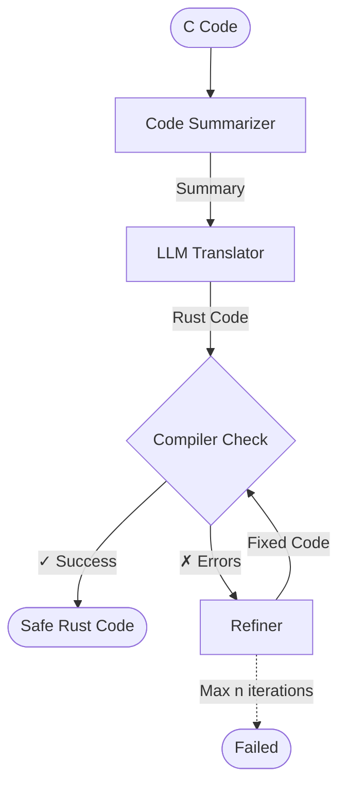

# GUARDIAN

**Guarded Universal Architecture for Defensive Interpretation And traNslation** is a prototype LLM-driven translation tool for transpiling C into safe Rust.

## Highlights
- Code summarization and compiler-guided refinement help prevent unsafe translations.
- Demonstrated **92.6% safe translations** and **100% compilation success** on 27 test cases (+22.2pp vs vanilla LLM).
- Supports single-function demos, adversarial benchmarks, and whole-project runs via `compile_commands.json`.

## Requirements & Installation

### Prerequisites
- Python 3.10+
- [uv](https://docs.astral.sh/uv/) or any PEP 517–compatible installer
- Rust toolchain via `rustup`
- Access to a LiteLLM compatible endpoint

### Install

```bash
git clone https://github.com/athalang/defacc.git
cd defacc
uv sync
```

### Configure an LLM

```bash
cp .env.example .env
```

Set model + credentials in `.env`:

```
MODEL=hosted_vllm/Qwen/Qwen3-Coder-30B-A3B-Instruct
TEMPERATURE=0.7
API_KEY=your-key-here
```

See `QUICKSTART.md` for more configuration recipes.

## Usage

### Try the default demo
```bash
python main.py
```

### Target a built-in test
```bash
python main.py --test buffer_overflow
python main.py --test use_after_free
python main.py --all
```

### Translate a multi-file project
- Generate a `compile_commands.json` (CMake or Bear/Make).
- Run `python main.py --compile-commands path/to/compile_commands.json --output-rust translated.rs`.
- `QUICKSTART.md` walks through each step in detail.

## Evaluation

```bash
# Run all tests
inspect eval guardian/evals/c_to_rust.py@all_tests

# Focus on subsets
inspect eval guardian/evals/c_to_rust.py@basic_tests
inspect eval guardian/evals/c_to_rust.py@adversarial_tests

# Compare against the vanilla baseline
./scripts/run_baseline_comparison.sh
python scripts/generate_comparison_report.py
```

Use `inspect view` to view the inspect logs and `guardian/tests/test_paper_examples.py` for fast local checks.

## Architecture


```mermaid
graph TD
    Start([C Code]) --> Summarizer[Code Summarizer]
    Summarizer -->|Summary| Translator[LLM Translator]
    Translator -->|Rust Code| Compiler{Compiler Check}
    Compiler -->|✓ Success| Done([Safe Rust Code])
    Compiler -->|✗ Errors| Refiner[Refiner]
    Refiner -->|Fixed Code| Compiler
    Refiner -.->|Max n iterations| Failed([Failed])
```

- **Summarization:** `CodeSummary` extracts declaration-level purpose before translation.
- **Detection:** Generated Rust is compiled; failures emit structured diagnostics for the LLM.
- **Correction:** `Refiner` retries with compiler feedback (bounded to 3 iterations) to avoid regressions.

Tests span buffer overflows, dangling pointers, null derefs, integer and type safety issues, and undefined behaviors like format string exploits.

## Project Layout

```
.
├── main.py                 # CLI entry point
├── guardian/
│   ├── pipeline.py         # Pipeline orchestration
│   ├── dspy_modules.py     # Summarizer, Translator, Refiner modules
│   ├── compiler.py         # rustc wrapper + refinement loop
│   ├── evals/c_to_rust.py  # Inspect AI tasks
│   └── tests/test_paper_examples.py
├── scripts/
│   ├── run_baseline_comparison.sh
│   └── generate_comparison_report.py
└── QUICKSTART.md           # Detailed walkthrough & troubleshooting
```
